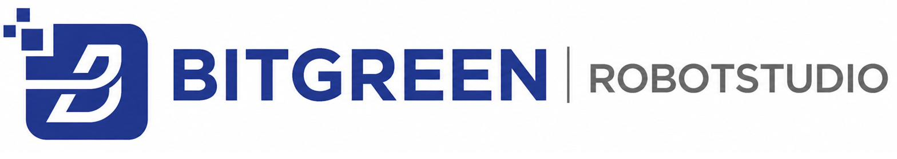

<p align="center">
  
</p>

<h1 align="center">BITGREEN Robot Studio</h1>

<p align="center">
  Browser-based, multi-user ROS simulation platform. Every student gets an isolated
  robot environment with a 3D viewer, terminal, code editor and file explorer, with
  nothing to install locally.
</p>

---

## Features

- **Isolated per-student sims.** Each client gets their own Docker container with its own roscore and headless Gazebo.
- **Host dashboard.** The admin can see connected clients, mirror their terminals, browse their files and switch the robot model.
- **Robots.** TurtleBot3 Burger (empty world, TB3 world, generated arena with `move_base` navigation) and UR5 arm (IK, joint jog, trajectory playback).
- **In-browser tooling.** Three.js 3D viewport, xterm.js shells (PTY over WebSocket), CodeMirror editor, 1 GB per-user file space.
- **Accounts.** SQLite + bcrypt, session tokens, and signup verified by email OTP.
- **UI.** Styled after ABB RobotStudio, with BITGREEN blue `#263689`.

## Architecture

```
 Browser (login / index / host)
        │  HTTP + WebSocket /ws/{id}
        ▼
 ┌──────────────────────────┐        docker exec
 │ server.py (FastAPI :8000)│ ─────────────────────────────┐
 │  auth · PTY hub · files  │                              │
 └──────────────────────────┘                              ▼
        │                                  ┌──────────────────────────────┐
        │ docker exec                      │ ros_client_<user>  (×N, max 3)│
        ▼                                  │ roscore · Gazebo · robot      │
 ┌────────────────────────────┐            └──────────────────────────────┘
 │ ros_desktop (host container)│
 │ roscore · rosbridge :9091   │
 │ Linux accounts per user     │
 └────────────────────────────┘
```

See [`docs/ARCHITECTURE.md`](docs/ARCHITECTURE.md) for details.

## Repository layout

```
├── server.py              FastAPI app: routes, WebSocket hub, PTYs, file API
├── auth.py                SQLite users, bcrypt, sessions, OTP flow
├── email_otp.py           Gmail SMTP sender for signup codes
├── container_manager.py   Per-client container lifecycle, sim launch, teleop, nav
├── gazebo_manager.py      Gazebo process + log management
├── linux_user.py          Per-user Linux accounts & home-jailed file ops
├── models.py              Robot model catalog (TB3, UR5), worlds, nav map
├── static/                login, signup, client (index) and host pages
├── scripts/               start / stop / Gazebo log cleanup
├── docker/Dockerfile      Reference build for ros_noetic_ready image
└── docs/                  Architecture & troubleshooting
```

## Requirements

- macOS (Apple Silicon tested) or Linux x86_64
- Docker Desktop / Docker Engine. On Apple Silicon, amd64 images run under QEMU.
- Python 3.9+
- The `ros_noetic_ready:latest` image (ROS Noetic, Gazebo, TurtleBot3, UR5, rosbridge)

## Quick start

```bash
git clone https://github.com/<your-username>/bitgreen-robot-studio.git
cd bitgreen-robot-studio

# 1. Build the ROS image (one time, slow under QEMU)
docker build --platform linux/amd64 -t ros_noetic_ready:latest docker/

# 2. Configure
cp .env.example .env        # set admin username/email + SMTP app password

# 3. Run (creates venv, starts ros_desktop + rosbridge, launches server)
./scripts/start.sh
```

Then open:

| Page        | URL                           |
|-------------|-------------------------------|
| Login       | http://localhost:8000/login   |
| Sign up     | http://localhost:8000/signup  |
| Client view | http://localhost:8000         |
| Host panel  | http://localhost:8000/host    |

Sign up with the username/email you set as `ROS_ADMIN_*` to get the host role.
Other devices on the same network should use the machine's LAN IP instead of `localhost`.

Stop everything with `./scripts/stop.sh` (add `--all` to also stop `ros_desktop`).

## Configuration

| Variable             | Purpose                                     |
|----------------------|---------------------------------------------|
| `ROS_ADMIN_USERNAME` | Reserved admin username                     |
| `ROS_ADMIN_EMAIL`    | Reserved admin email (must match username)  |
| `ROS_SMTP_USER`      | Gmail address that sends OTP codes          |
| `ROS_SMTP_PASS`      | 16-character Gmail App Password             |

Tunables such as `MAX_CONTAINERS`, `SPAWN_TIMEOUT` and `SHM_SIZE` live at the top of `container_manager.py`.

## Development notes

- **HTML changes** need a hard reload (Cmd/Ctrl-Shift-R).
- **Python changes** need a server restart: re-run `./scripts/start.sh`.
- **Stopping rospy scripts** requires `pkill -9`, because rospy ignores SIGTERM.
- **Disk filling up** usually means runaway Gazebo logs. Run `./scripts/clean_gazebo_logs.sh`.

More in [`docs/TROUBLESHOOTING.md`](docs/TROUBLESHOOTING.md).

## Roadmap

- MoveIt / `move_group` support for the UR5 sample script
- Pinned front-end dependencies served locally (offline mode)

## Acknowledgements

Built at BITGREEN Technolabz. Inspired by The Construct's ROS Development Studio.
